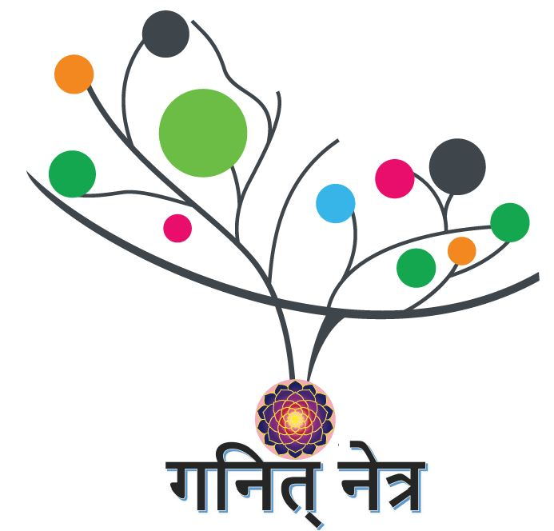

```{r setup, include=FALSE}
knitr::opts_chunk$set(echo = FALSE,out.width="400px", dpi=120)
```

## Ganitha Netra

> First National Level math short video contest hosted by Department of Mathematics

```{r ,fig.align = 'center',out.width="50%", fig.cap="Logo of Ganitha Netra event"}

```


----

> **Theme of the contest:** *Mathematics in Nature*

----

> **Targeted participants:** Students from Engineering Colleges in India (Valid College ID proof is required)

> **About the event:** An event specially designed to visualize the world around us through the fascinating kaleidoscope of Mathematics. A team work with a mathematical mind and logic always produce wonderful products. The math vision is the skill of viewing the space around you through the magnifying lens of Mathematics. Do you believe that you have that math vision with in you? Then, ${\color{red}{\text{Ganita Netra}}}$- *The short math video contest* that explore the nature through mathematics is a right place to showcase your math vision skill to the entire country. Let's join the celebration of exploring patterns in the nature.

----

### Details of the event

> **Time limits**

        - Presentation time-5 minutes.
        - Narrations/ explanation- 2 minutes


        
> **Total prize money**

        - Total prize money is 6K
        
----

### Prize money distribution

        - First prize-  3K
        - Second prize- 2K
        - Third price-  1K
        
### Rules & Regulations

   - Maximum duration of the video is 5 minutes
   
   -  Submit video links (through the Google form shared) after uploading the video in personal drive.
   
   -  Only self made videos are allowed. Downloaded/ edited videos from external sources are not accepted in the competition. 
   - Theme of the video shall be "Mathematics in Nature".
   - Background music and inline narration are also allowed.
   - Maximum time allotted to a team is 7 minutes including initial preparations.
   - Decisions of the judges shall be final.
   - Minimum participation to claim a prize is 3.

----

### Contacts

>*For more details, contact:*


- Nehna Lezya Sarin M, 📱 7736638441

- Neeraja Anil, 📱 7736266317

- Bijo Babu Cherian, 📱 8075210440


----


